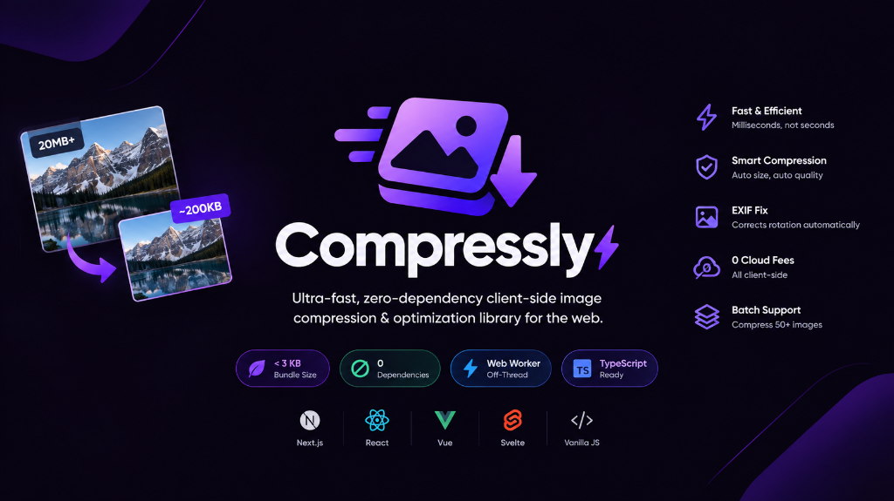

<p align="center">
  
</p>

# Compressly ⚡

> **Ultra-fast, zero-dependency client-side image compression & optimization library for the web — Next.js, React, Vue, Svelte & Vanilla JS with Web Worker support.**

[](https://opensource.org/licenses/MIT)
[](https://bundlephobia.com)
[](https://npmjs.com/package/compressly)
[](https://www.typescriptlang.org)

Compressly eliminates annoying *"Image size too large"* upload errors. It enables users to upload **any photo of any resolution or size** (even 20MB+ 4K camera photos), automatically downscaling dimensions, fixing EXIF rotation, and compressing files down to ~200KB–500KB on the client device in milliseconds with **0$ cloud fees** and **0 UI lag**.

---

## ⚡ Highlights

- 🪶 **Ultra-Lightweight (< 3 KB):** Zero external dependencies. 95% smaller bundle footprint than legacy libraries (~52 KB).
- 🧵 **Off-Thread Web Worker:** Runs compression inside a Web Worker via `OffscreenCanvas` when supported. Butter-smooth 60 FPS UI on low-end devices.
- 🎯 **Adaptive Target Size Loop:** Set `targetSizeMB: 0.5` and Compressly automatically iterates to ensure output stays under your exact limit.
- 📦 **Concurrent Batch Mode:** Upload 50 images at once with built-in concurrency pooling (`compressImages`).
- 🔄 **Auto EXIF Orientation:** Corrects vertical iPhone / Android photos automatically using native browser APIs.
- ⏭️ **Smart Pass-Through:** Small images under `maxSizeMB` bypass compression automatically to save battery and time.
- 🛡️ **SSR & Next.js Safe:** Built with dual ESM/CJS exports and SSR guards. No `window is not defined` crashes.
- ⚛️ **First-Class React Hook:** Ships with optional `useImageCompressor()` for instant reactive UI progress bars.

---

## 📊 Comparison vs Existing Alternatives

| Feature / Metric | **Compressly** ⚡ | `browser-image-compression` | `compressorjs` |
| :--- | :---: | :---: | :---: |
| **Bundle Size (Minified)** | **< 3 KB** | ~52 KB | ~25 KB |
| **Runtime Dependencies** | **0 (Zero)** | Multiple | 0 |
| **Off-Thread Web Worker** | **Yes (`OffscreenCanvas`)** | Yes | No |
| **Adaptive Target Size Loop** | **Yes (`targetSizeMB`)** | Yes | No |
| **Concurrent Batch Mode** | **Yes (`compressImages`)** | Manual loop | Manual loop |
| **Auto EXIF Orientation** | **Yes (Native)** | Yes | Yes |
| **Next.js / SSR Safe** | **Yes (Out of the box)** | Requires workaround | Requires workaround |
| **Smart Pass-Through** | **Yes** | No | No |
| **React Hook Included** | **Yes (`useImageCompressor`)** | No | No |

---

## 📦 Installation

```bash
# pnpm
pnpm add compressly

# npm
npm install compressly

# yarn
yarn add compressly

# bun
bun add compressly
```

---

## 🚀 Quickstart

### 1. Single Image Compression (Vanilla JS / Any Framework)

```typescript
import { compressImage } from "compressly";

// Handles input change or dropzone file
const onFileSelected = async (file: File) => {
  const optimizedFile = await compressImage(file, {
    maxWidth: 1920,      // Max width in pixels (aspect ratio preserved)
    quality: 0.82,       // 82% quality (indistinguishable, -85% file size)
    targetSizeMB: 0.5,   // Guarantee output is <= 500 KB
    onProgress: (percent, phase) => {
      console.log(`Progress: ${percent}% (${phase})`);
    },
  });

  // Ready to send to your backend!
  const formData = new FormData();
  formData.append("photo", optimizedFile);
  await fetch("/api/upload", { method: "POST", body: formData });
};
```

---

### 2. Multi-File Batch Compression

```typescript
import { compressImages } from "compressly";

// Compress 20 files concurrently without blowing up mobile RAM
const optimizedFiles = await compressImages(fileList, {
  concurrency: 3,        // Max 3 images in parallel
  maxWidth: 1920,
  quality: 0.82,
  onBatchProgress: (overallPercent, completed, total) => {
    console.log(`Batch: ${overallPercent}% (${completed}/${total} files)`);
  },
});
```

---

### 3. React Hook (`compressly/react`)

```tsx
import React from "react";
import { useImageCompressor } from "compressly/react";

export function ProfileAvatarUpload() {
  const { compress, isCompressing, progress, phase, lastResult } = useImageCompressor({
    maxWidth: 1024,
    quality: 0.85,
  });

  const handleChange = async (e: React.ChangeEvent<HTMLInputElement>) => {
    const file = e.target.files?.[0];
    if (file) {
      const result = await compress(file);
      console.log(`Saved ${result.reductionPercentage}% in ${result.timeTakenMs}ms!`);
    }
  };

  return (
    <div>
      <input type="file" onChange={handleChange} disabled={isCompressing} />
      {isCompressing && <p>Optimizing image ({phase})... {progress}%</p>}
      {lastResult && <p>Reduced to {(lastResult.compressedSize / 1024).toFixed(0)} KB!</p>}
    </div>
  );
}
```

---

## ⚙️ Options Reference

### `CompressOptions`

| Option | Type | Default | Description |
| :--- | :--- | :--- | :--- |
| `maxSizeMB` | `number` | `1` | File size in MB below which compression is skipped. |
| `targetSizeMB` | `number` | `undefined` | Target max file size. Triggers adaptive iterative optimization. |
| `maxWidth` | `number` | `1920` | Max output width in px (preserves aspect ratio). |
| `maxHeight` | `number` | `1920` | Max output height in px (preserves aspect ratio). |
| `quality` | `number` | `0.82` | Quality factor (0.1 to 1.0) for JPEG/WebP. |
| `mimeType` | `string` | `undefined` | Force output to `"image/jpeg"`, `"image/webp"`, or `"image/png"`. |
| `useWorker` | `boolean` | `true` | Runs in Web Worker via `OffscreenCanvas` when supported. |
| `autoRotate` | `boolean` | `true` | Automatically adjusts EXIF camera rotation. |
| `forceResize` | `boolean` | `false` | Resizes even if file size is already smaller than `maxSizeMB`. |
| `onProgress` | `Function` | `undefined` | `(progress: number, phase: CompressionPhase) => void` |

---

## 📄 License

MIT &copy; 2026 [Mostafa Mohamed Abdalla](https://github.com/Mostafashadow1)
